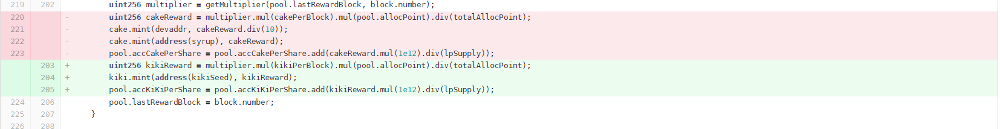

# v1.0.0 Release Notes

This contract is based on pancake masterchef v1

pancake-smart-contracts/projects/farms-pools/ 

[github link](https://github.com/pancakeswap/pancake-smart-contracts/tree/master/projects/farms-pools)

## Changed files compared with pancake:

### Deleted
- libs/
- BnbStaking.sol
- CakeToken.sol
- SmartChef.sol
- SmartChefFactory.sol
- SmartChefInitializable.sol
- Timelock.sol

### Added
- interfaces/IERC20Mintable.sol  // ERC20 interface

### Modified
- MasterChef.sol
- SyrupBar.sol

## Modification Details

### MasterChef.sol

#### 1. token rename
rename token Cake to KIKI

#### 2. BEP20 rename to ERC20

rename token interface name from BEP20 to ERC20

#### 3. remove MigratorChef

#### 4. allow owner to update `multiplier` and `kikiPerBlock`

#### 5. remove dev tax

### SyrupBar.sol

#### 1. token rename
rename token Cake to KIKI

#### 2. BEP20 rename to ERC20
rename token interface name from BEP20 to ERC20

#### 3. remove delegate functions

remove all functions related to delegation